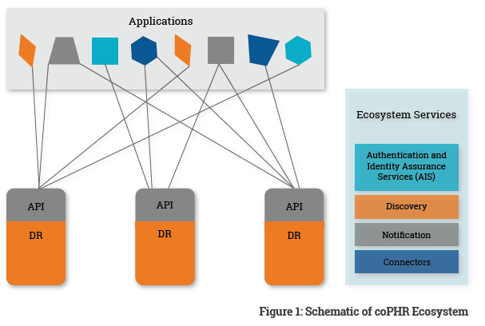
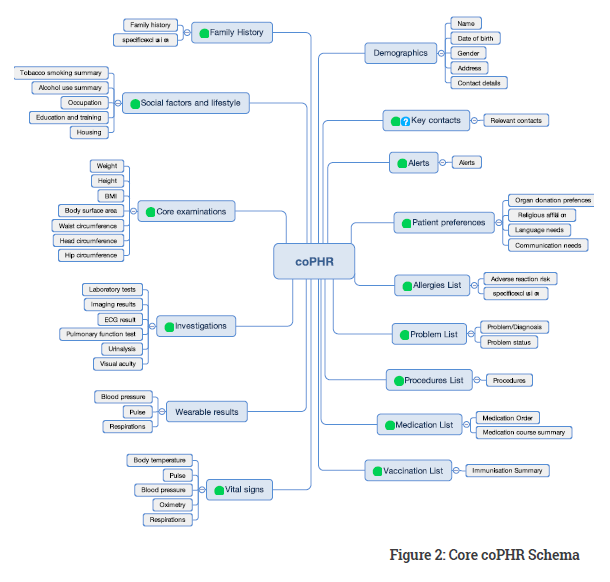
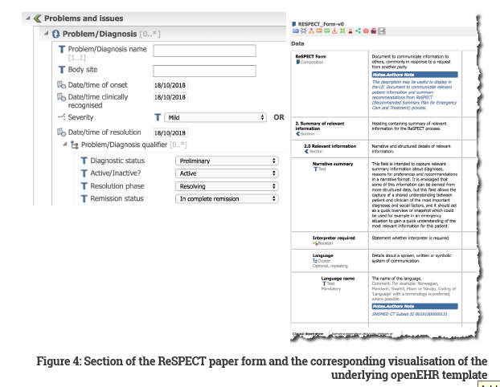

## A Blueprint for a Co-Produced

## Personal Health Record

## (CoPHR) Ecosystem

1. Introduction
2. Scope
3. Background
4. Nine Principles of the coPHR
5. Construction of a coPHR
**5.1** The coPHR Schema
**5.2** The Data Repository (DR)
**5.3** Authentication and Identity Assurance Services (AIS)
**5.4** A Discovery Service
**5.5** coPHR-compliant Applications
**5.6** Connectors to other systems
**5.7** Connectors to Notification Services

6. coPHR Ecosystem
**6.1** Architecture
**6.2** Data Repository (DR)
**6.3** Application Programming Interfaces (APIs)
**6.4** Applications
**6.5** Ecosystems Services

7. coPHR Schema
**7.1** Core coPHR Schema
**7.2** coPHR Schema Extensions

8. Technical Requirements
**8.1** Data Repository (DR)
**8.2** coPHR Applications

9. Proposed extensions to the coPHR Ecosystem

10. coPHR Governance
**10.2** Technical Governance
**10.3** Maintenance of the Governance Framework
**10.4** Legal Agreements
**10.5** Trusted Body

11. Appendix 1: Scenario

12. Appendix 2: Governance Framework Heads of Agreement

**12.1** Apperta and DRP Agreement
**12.2** Apperta and Developer Agreement
**12.3** Apperta and Third Party Agreement
**12.4** Data Subject and DRP Agreement
**12.5** Third Party and DRP Agreement

13. Appendix 3 - Data Retention Policy

14. Appendix 4: Definition of Terms

Hildegard (Hildi) McNicoll (née Franke) 1959 - 2018
This document is dedicated to one of its authors Hildi McNicoll
who sadly died shortly before its publication.

# 1. Introduction

This document describes a radically new approach to personal health records (PHR): the co-produced PHR (coPHR). The approach is different from current PHRs in a number of important ways:

- It is based on an open platform allowing any willing party to build a coPHR interoperable with any other.

- It clearly separates the record itself (the data) from the applications that are used to create and access it, allowing the creation of a coPHR ecosystem where there are potentially both many data repositories and many applications all working together. This means:

    - For an individual patient there is a single shared definitive record that any application can use. This avoids data silos and fragmentation of the record.

    - A user (patient, carer or health and care professional - HCP) can choose an application that is tailored to their needs rather than being shoehorned into a single PHR application.

- It has a predefined but easily extensible and configurable information model based on openEHR that describes the structure and content of the record in a standardised way - The “coPHR Schema”.

- It provides a simplified API that makes it easy for developers to build coPHR compliant applications.

- It is designed to be medico-legally valid with clear data attribution and provenance, and a comprehensive audit trail.

    - It operates within a governance framework that protects the interests of both patients and HCPs.

    - The approach treats the patient as a full partner whilst providing regulated ongoing access by HCPs to data previously shared with them by the patient via the coPHR and which they may have previously relied upon.

- Over time the coPHR is intended to become the ‘system of record’ i.e. the primary data store for both patient and professionally provided data.

Appendix 1 provides a scenario of a use case for the coPHR.

# 2. Scope

This document has been published as a Request for Comments from interested parties.

It aims to provide sufficient detail to enable the creation of an initial proof of concept of the coPHR ecosystem in which it will be possible to test the ideas and processes described in this document.

We acknowledge that there are certain governance and technical issues associated with the proposals
as they currently stand and as presented within this document.

Nevertheless, we are of the view that the conceptual coPHR framework presented in this document is sufficiently developed to facilitate a constructive engagement and conversation with interested parties.
We welcome valued feedback from the stakeholder community, to enable the efficient and effective progress
towards a coPHR framework that is accepted by the broader community.

# 3. Background

There has been both considerable interest and confusion with the concept of a PHR. This confusion
starts with a lack of clarity as to what PHR stands for and what a PHR is.

PHR has been used to mean Personal Health Record, Patient Health Record and Patient Held Record. While those working on individual projects know what they mean by these terms, the terms have no generally accepted meaning which adds to the confusion.

PHRs fall into a number of categories:

1. Those that are controlled by an individual to record their health and fitness data, and where the individual has little or no intention of sharing it with the HCPs looking after their care.

2. Those controlled by a health and care organisation and to which the patient has been given read and sometimes write access and possibly some control over how data is shared.

3. Those controlled by the patient, where the patient has the intention of sharing access with the HCPs looking after their care. The patient has absolute control of access and sharing with the ability to enter, edit and delete data, often without any audit trail.

While many of these PHRs will contain very similar core dataset, they do so in proprietary formats which often fail to reflect the full complexity of health data and make the sharing of data difficult.

This free-for-all creates a number of problems:

- It generates PHR silos. It is quite possible for a patient to have data held by multiple PHRs in category 2 above.

- PHR applications often end up being “one-size-fits-all” whereas the needs of different users are difficult to satisfy with a single application.

- Where HCPs have been granted access to PHRs (e.g. category 3 above), they need to retain a copy of
    the data in their own system: they cannot rely on the medico-legal validity of the PHR and to continuing access to information they may have relied upon for decision-making.

- The failure or withdrawal from the market of a PHR vendor can result in the loss or degradation of the record.

- It is difficult or impossible to transfer data to alternative PHRs or to systems used by HCPs.

The coPHR provides solutions to these problems.

# 4. Nine Principles of the coPHR

The coPHR has nine principles with which all participating parties must comply:

1. All coPHRs share a single extensible openEHR data model.

2. Patients have control of who is granted the ability to contribute data to their coPHR and/or view data stored in their coPHR.

3. Once granted, the patient cannot revoke the rights of a Third Party to have continuing access to data that they may have relied on when advising or treating the patient. The patient may at any time revoke the right to contribute or view new data.

4. The coPHR must record and attest to the provenance of data entered into it.

5. The coPHR must maintain an audit trail such that the state of the record at any given point in time can be recreated with full-tracking of modifications or deletes.

6. The coPHR is operated in such a way that the data in the record is protected from loss or corruption.

7. The coPHR must maintain the medico-legal evidential validity of the record in compliance with the Civil Evidence Acts (1968, 1995) and Police and Criminal Evidence Act 1984.

8. The patient can transfer all of the data and data definitions to another accredited coPHR provider or download their coPHR for their own purposes.

9. The patient can annotate entries made by others to clarify or correct them, but changes and deletions can only be made by the original author or their proxy. Where changes or deletions are made, the original data will normally be retained in the audit trail in line with the retention policy in Appendix 3.

# 5. Construction of a coPHR

The creation of a coPHR requires the following components:

1. The coPHR Schema
2. Discovery Service
3. coPHR Data Repository (DR)
4. Authentication and identity assurance service (AIS)
5. coPHR-compliant Application

The intention is that there will be multiple providers of each component (3-5) that can be chosen in any combination by users.

Apperta will produce an open source exemplar coPHR application. This is not intended to compete with applications from other developers, but to provide a:

- Generic coPHR application that others can adapt;

- Trusted application by which a patient can verify the data stored on their coPHR and view who have accessed it; and

- Manage access permissions.

In addition, further components can optionally extend the function of the coPHR:

6. Connectors to other systems (includes Internet-of-Things, IoT devices)
7. Connectors to Notification Services

Any interested party can build any of these components, and any combination of compliant components should work together. It is expected that a minimal viable coPHR requires a DR, at least one App and access to an AIS.

## 5.1 The coPHR Schema

The coPHR Schema uses openEHR to represent the structure of the coPHR and define its content.

The Schema comprises a small core which is predefined by Apperta and a set of predefined extensions outside the core which users are free to use or adapt.
A mechanism is provided to allow any party to add new extensions when the core and existing extensions do not meet their needs, subject to these being shared with the coPHR community via Apperta. Whilst this approach removes some of the flexibility normally provided by openEHR it makes it much easier to build
PHR applications as much of the work is already done. It is anticipated that, over time, extensions that are stable and widely used will be incorporated into the core and that many more extensions will be added by the coPHR Community.

## 5.2 The Data Repository (DR)

The DR comprises of three components:

- An openEHR-compliant Clinical Data Repository (CDR)

- A demographics service supporting the HL7 FHIR demographics profiles: Patient, Provider, Organisation

- A Vendor Neutral Archive able to store documents and images linked to entries in the openEHR CDR - Supported formats are DICOM, ODF, JPEG and PDF

The DR is constrained to use the core coPHR Schema and its extensions only.

## 5.3 Authentication and Identity Assurance Services (AIS)

coPHR applications must authenticate their users to a DR by providing credentials from an Apperta Accredited AIS.
We envisage that the NHS will approve identity providers who meet the NHS’s required identity assurance standards. DR providers (DRPs) are free to accept any AIS that they are satisfied provides an adequate level of identity assurance for their purposes. However, the NHS is likely to require, that DRs only accept ID credentials from an NHS approved AIS if they wish to connect to NHS systems.

## 5.4 A Discovery Service

This is a centralised service that enables the location of an individual patient’s coPHR within the coPHR ecosystem. This service could be provided by the NHS Spine or by a service operated by Apperta solely to support the coPHR ecosystem.

## 5.5 coPHR-compliant Applications

All applications are required to be in line with the “Nine Principles of the coPHR”, in order to be deemed as coPHR-compliant.

## 5.6 Connectors to other systems

With healthcare data being held in multiple disparate and siloed systems, significant value is added to any application which is capable of pulling in data from other sources and acting itself as a source of data for other systems. The connectors which enable these functions must be based on open standards.

At the time of writing there are significant efforts to address this requirement:

The INTEROPen group is actively engaged in building and curating a set of FHIR profiles to support the Care Connect project.

A proof-of-concept Web service that exposes HL7 FHIR operations (read, search, conformance) from a choice
of openEHR CDRs for a small range of INTEROpen Care-Connect profiles can be found here: [https://github.com/Code4Health-Platform/openehr-care-connect-adaptor](https://github.com/Code4Health-Platform/openehr-care-connect-adaptor)

## 5.7 Connectors to Notification Services

Another challenge of siloed healthcare data is around notifications to patients and healthcare providers of events which are relevant and may impact on day-to-day care. Some examples include:

- Notification to the patient when laboratory test results are available

- Notification to the patient of future appointments

- Notification to the GP of childhood immunisations that have been done

- Notification to GP and patient of referrals having been received and being processed

The NHS Event Management Service is a pilot program attempting to address some of these challenges on a UK-wide basis. We anticipate that many coPHR implementations will benefit by utilising resources provided by this program.

# 6. coPHR Ecosystem

## 6.1 Architecture

The components of the coPHR ecosystem are shown in the figure below. This comprises the following items:

1. Data Repository (DR)
2. Application Programming Interface (API)
3. Applications
4. Ecosystem Services

Figure 1: Schematic of coPHR Ecosystem

## 6.2 Data Repository (DR)

A coPHR ecosystem may include one or more physical data repositories. They are each required to implement the same information model and expose the same APIs. The DRs may operate with different business models (e.g. one might charge the patient, another might be provided free by the patient’s STP, another might pay
the patient in return for use of their data). Patients are free to choose whichever DR they wish and are free to move their record between them as they wish.

## 6.3 Application Programming Interfaces (APIs)

Each DR exposes their APIs to coPHR applications, thereby enabling the applications to add to and manipulate data in the DR.

Initially the APIs exposed will be:

- openEHR API
- INTEROPen FHIR APIs
- HL7 FHIR demographics API
- IHE-XDS API

We propose that, in addition to the above APIs, a “simplified API” is developed that will address typical requirements of coPHR application developers.

Consideration should be given to implementing the Microsoft Healthvault (GetRealHealth CHBase) API which are in common use in the PHR market.

## 6.4 Applications

There are many applications, these are different shapes and sizes to suit the need of different users (e.g. one may be designed for a teenage diabetic, another for an elderly patient, while other might
be designed for the needs of an HCP accessing many patients records in multiple CDRs).

## 6.5 Ecosystems Services

There are four ecosystem services that are used by all applications:

**- Authentication and Identity Assurance Services (AIS)** - This allows the user to be identified and authenticated

**- Discovery** - This enables an application to discover which DR holds the record for a particular patient.

**- Notifications** - Either an event in a DR or an application can publish a notification to the notification service. Authorised and interested parties can subscribe to receive relevant notifications.

**- Connectors** - These provide connections to other systems. Their primary purpose is to enable the coPHR to upload information from other systems such as the patient’s GP record but may expose patient, device or professional data stored in the coPHR as a ‘system of record’.

This blueprint for the Ecosystem Services is based on the definition of an open platform described in [https://apperta.org/openplatforms]("Defining an Open Platform") published by the Apperta Foundation. The proposed coPHR ecosystem is in effect a microcosm of an open platform and represents an excellent starting point for a health and care community wishing to implement an open platform.

# 7. coPHR Schema

The coPHR Schema comprises the core coPHR Schema and optional extensions. All DRPs must implement the core coPHR Schema.

The core coPHR Schema is intended as the “base level” schema that will meet the majority of stakeholder requirements. Clearly, there will be use cases where the core coPHR Schema is insufficient, and in which case, the Governance Framework permits extensions to the schema.

DRPs may choose which of the available schema extension they wish to implement as required by the applications using their DR or to support data transferred in from another DR. Where a suitable extension does not exist, DRPs or Application Developers are free to create a new extension as described in Development and extension of coPHR Schema.

## 7.1 Core coPHR Schema

The core coPHR Schema is illustrated in the figure below.

**Demographics comprise:** Surname, Forename, Preferred name, date of birth, gender, address, contact details (telephone, email). We recommend that the FHIR Care Connect profiles are used as the basis for patient demographics

**Key contacts comprise:** formal, informal and main carer details and next of kin details (names, contact details, addresses).

**Alerts comprise:** any significant information meriting a specific and highly visible warning to any user of the coPHR (e.g. metallic implant, emergency keyholder information, potential dangerous pet).

**Patient Preferences comprise:** organ donation preferences, language and communication needs, reasonable
adjustments, religious/cultural preferences.

**Allergies List comprises:** causative agent, reaction/manifestation details.

**Problems List comprises:** problem name, description, onset and resolution dates Procedures List comprises: procedure name, description, body site, outcome, difficulty, complication and procedure type.

**Medication Statement List comprises:** medication name, form, route, direction and dosage instructions, patient information, monitoring instructions, clinical indication and start and stop dates.

**Immunisations List comprises:** immunisation name, status, immunisation date.

**Vital Signs comprise:** respiration rate, peripheral capillary oxygen saturation, heart rate, body temperature, systolic and diastolic blood pressure.

**Wearable results** currently comprise largely a subset of Vital Signs e.g. pulse, blood pressure, oxygen saturation.

**Lab results comprise:** test name, result details and interpretation and reference ranges.

**Other investigations comprise:** imaging results, ECG results, pulmonary function tests, visual acuity and urinalysis.

**Core examinations comprise:** height, weight, BMI, waist, head and hip circumference and body surface area. 

**Lifestyle and Social summary comprises:** smoking status, alcohol consumption, housing, occupation and education/training.

**Family history comprises:** index condition, affected relative and related genomic markers (e.g. BRCA1 and BRCA2).

## 7.1.1 Core coPHR Templates

In order to define a core coPHR Schema, it is necessary to define the dataset for each individual component of the core coPHR Schema, using openEHR ‘templates’ to define these clinical standards.

The figure below illustrates, as an example, the openEHR ‘Problems List’ template. The Problems List is the data schema used to define how a Problems List should be stored and queried in the coPHR.

Figure 3: The Problems List openEHR template

Examples of other templates can be found
at:
- [http://ckm.apperta.org/](http://ckm.apperta.org/) ckm/#showTemplate_1051.57.71 (Allergies List)
- [http://ckm.apperta.org/ckm/#showTemplate_](http://ckm.apperta.org/ckm/#showTemplate_) 051.57.134 (Problems List)
- [http://ckm.apperta.org/ckm/#showTemplate_](http://ckm.apperta.org/ckm/#showTemplate_) 051.57.140 (Procedures List)
- [http://ckm.apperta.org/](http://ckm.apperta.org/) ckm/#showTemplate_1051.57.143 (Medication Statement List)
- [http://ckm.apperta.org/](http://ckm.apperta.org/) ckm/#showTemplate_1051.57.141 (Vital Signs Encounter)

A first tranche of FHIR connectors (based on these templates) is at:

[https://github.com/Code4Health-Platform/openehr-care-connect-adaptor](https://github.com/Code4Health-Platform/openehr-care-connect-adaptor)

Whilst the above examples provide useful material, further work is required to create an agreed core coPHR Schema, though much has already been covered by the Apperta Foundation and Ripple Foundation.

## 7.2 coPHR Schema Extensions

### 7.2.1 Why an Extension?

It is accepted by the stakeholders that there will be elements of the record which will not be shareable beyond any local community who have agreed extensions to the core coPHR Schema. Extensions are defined as those aspects of the record where local variations exist.

It is quite possible, and in some cases highly likely, that a dataset or schema may start life as an extension, but becomes promoted to core in due course, as part of an ongoing process of standardisation.

There are also situations where a number of local variations which are well established and reasonably stable will be offered as alternatives within the core coPHR Schema rather than being seen as local extensions only.

### 7.2.2 Example Extensions

#### 7.2.2.1 End of Life Care datasets

End of Life Care datasets currently vary significantly in different communities. Examples include:

- Leeds End of Life Care Coordination [http://ckm.apperta.org/ckm/#showTemplate_1051.57.29](http://ckm.apperta.org/ckm/#showTemplate_1051.57.29)
- Scottish Key Information Summary [https://www.snughealth.org.uk/gp-software/ecs-and-kis/key-information-summary/](https://www.snughealth.org.uk/gp-software/ecs-and-kis/key-information-summary/)
- Anticipatory Care Plan in Scotland [http://ihub.scot/anticipatory-care-planning-toolkit/](http://ihub.scot/anticipatory-care-planning-toolkit/)

At the time of writing, a UK-wide standard for capturing the patient’s resuscitation wishes is being developed (ReSPECT [https://www.respectprocess.org.uk/](https://www.respectprocess.org.uk/)), and it is assumed that before long the template which has already been built for this will become part of the core coPHR Schema proposed above.

The ReSPECT template can be found at [http://ckm.apperta.org/](http://ckm.apperta.org/ckm/#showTemplate_1051.57)

Figure 4: Section of the ReSPECT paper form and the corresponding visualisation of the underlying openEHR template

#### 7.2.2.2 Maternity care records

The Professional Records Standards Body (PRSB) are running a consultation to develop a standard. There is presently significant local variation so that, until agreement is reached, we expect that schema extensions will be applied. We anticipate that, in due course, a single schema extension will be agreed and adopted within the core coPHR Schema.

Examples of local variations can be found at these links:

[http://www.meht.nhs.uk/EasysiteWeb/getresource.axd?AssetID=13290&type=full&servicetype=Attachment](http://www.meht.nhs.uk/EasysiteWeb/getresource.axd?AssetID=13290&type=full&servicetype=Attachment)[http://www.royalberkshire.nhs.uk/Downloads/GPs/GP%20protocols%20and%20guidelines/Maternity%20Guidelines%20and%20Policies/Professional%20guidelines/Record%20keeping%standards_V3.2_GL901.pdf](http://www.royalberkshire.nhs.uk/Downloads/GPs/GP%20protocols%20and%20guidelines/Maternity%20Guidelines%20and%20Policies/Professional%20guidelines/Record%20keeping%standards_V3.2_GL901.pdf)
[http://www.gloshospitals.nhs.uk/SharePoint1/Non-Clinical%20Policies/B0556.pdf](http://www.gloshospitals.nhs.uk/SharePoint1/Non-Clinical%20Policies/B0556.pdf)

# 8. Technical Requirements

As part of Technical Governance (refer to Section 10.2), components in the coPHR need to meet the minimum requirements described below in order to achieve accreditation.

## 8.1 Data Repository (DR)

The DR should be an openEHR CDR compliant with the current stable version of the openEHR specification available from [http://openEHR.org](openEHR.org).

**Implementers of a coPHR DR, new to openEHR, are strongly advised to build their DR on an existing compliant openEHR CDR of which a number of both proprietary and open source implementations are available.**

In addition to compliance with the openEHR standard, the DR must implement the following features:

### 8.1.1 APIs

The DR must implement the APIs referenced in Application Programming Interfaces (APIs) as updated from time-to-time by Apperta.

### 8.1.2 User Management and Authentication

Users include both the patient (as the owner of the coPHR) and Third Parties to whom a patient has granted access. Before a user can create or access a coPHR they need to register with an AIS who will verify their identity and provide credentials that they can use to create their own coPHR or access another coPHR to which a patient has granted access.

###  8.1.3 Access control

1. The patient must be able to control who can view the data stored in their coPHR and contribute data to the coPHR.
 - The coPHR must provide the facility to set up sharing arrangements with Third Parties.
 - The coPHR must provide the facility to define the Third Party’s permitted access:
    - i. view only
    - ii. view and annotate
    - iv. view, write and edit
    - v. view, write, edit and logically delete.
- The coPHR must provide the facility to allow or deny access by a Third Party to high level categories of data, e.g. access to allow the third party access to allergies and medications but not to social and lifestyle summary.

2. The patient must be able to control who can view the audit information relating to access to the coPHR.

3. If a patient changes their mind about access by a Third Party once this has been granted, the patient must be able to withdraw the right for the Third Party to contribute new data or view new data from the point when access is being restricted.

4. If the patient changes their mind about access by a Third Party once this has been granted, the patient must not be able to withdraw the right for the third party to view existing data to which the Third Party had access.

### 8.1.4 Provenance and audit

1. The coPHR must support full provenance of any data contributed.
    - The coPHR must record the name of the contributor.
    - The coPHR must record the role of the contributor.
    - The coPHR must record the date of the contribution.
    - Where data has been provided by a device, the device must be clearly identifiable.

2. The coPHR must provide a complete audit trail of all user activity.
    - The coPHR must track all data additions.
    - The coPHR must track all data modifications.
    - The coPHR must track all data deletions.
    - The coPHR must track all data accesses.
3. The following attributes must be available in the audit trail:
- Date of activity
- Type of activity (view, add, edit, delete)
- Content (which data was viewed, added, edited or deleted)
- Details of party that made changes to the data (name, role, device or IP address used for activity)

### 8.1.5 Transfer of data

The DR must provide facilities for the patient’s coPHR data to be downloaded by the patient or transferred directly to another DR on the patient’s request. Where a patient has chosen to transfer
the content of their coPHR to another DRP, the original DRP must ensure that the patient’s original coPHR is deleted from their DR once the transfer is successfully completed.

## 8.2 coPHR Applications

An application must store all coPHR data with an accredited DRP.

The detailed functionality of an application designed to access a coPHR is a matter for the application developer depending on the use case(s) they aim to satisfy.

# 9. Proposed extensions to the coPHR Ecosystem

There are a number of possible extensions to the functionality that might be added to the coPHR ecosystem. These are not essential to the initial implementation of a coPHR ecosystem but would provide added value. We describe some of these below:

**- Connectors to external systems** - These will allow external systems to automatically contribute data to the coPHR.

**- Device integration** - As currently defined, data from wearable and other near patient devices can only be recorded in their coPHR via an application that handles the required device integration. In the future an additional component could be added to the ecosystem that allow devices to record their data directly into their coPHR.

**- Chat/Messaging Functions** - A chat/ messaging function (similar to WhatsApp) could be added to systems thereby enabling secure chat between parties with whom a coPHR is shared.

**- Event Notification Systems** - Event notifications systems could be provided as part of the coPHR ecosystem or could use an external local or national notification systems such as the NHS Digital Event Management Service [https://developer.nhs.uk/apis/ems-beta](https://developer.nhs.uk/apis/ems-beta)

# 10. coPHR Governance

The core principles of the coPHR necessitate that the coPHR operates within a governance framework which
provides for:

1. Information and Clinical Governance
2. Technical Governance
3. Maintenance of the Governance Framework.

Creating this governance framework requires:

4. Legal Agreements - between the parties in the coPHR ecosystem
5. Trusted Body - to oversee the coPHR ecosystem.

## 10.1 Information and Clinical Governance

Information and Clinical Governance is concerned with ensuring that the record remains available and medico-legally valid and that all parties accessing the coPHR respect the rights and responsibilities of all other parties.

The Governance Framework that relates to Information and Clinical Governance must:

1. Ensure the patient remains at all times in control of their coPHR.

2. Ensure the medico-legal rights of Third parties who have relied on the shared coPHR data when making clinical decisions to defend a claim for negligence or misconduct.

3. Protect all parties, including the patient, from the medico-legal consequences of accidental or deliberate alteration/deletion of existing records. In essence the data is handled as if it were in a professional record, where the patient is treated as if they are a full member of the professional team, with accorded rights and responsibilities.

### 10.1.1 Data contained within the coPHR

The coPHR comprises the following categories of data which together make up the coPHR: 

<table class="tg">
  <tr>
    <th class="tg-0pky">Category of Data</th>
    <th class="tg-0pky">Description</th>
  </tr>
  <tr>
    <td class="tg-0pky">1. Personal data of patient  </td>
    <td class="tg-0pky">- Health and Care data of Patient - Demographics data of patient - Details of persons that the patient permits to have access to their data</td>
  </tr>
  <tr>
    <td class="tg-0pky">2. Data defining Permitted Access rights by Third Parties  to a patient’s personal data </td>
    <td class="tg-0pky">- The granular aspects of data that the person is permitted to access - The date that permission was given - The date that permission was rescinded</td>
  </tr>
  <tr>
    <td class="tg-0pky">3. Personal data of Third Parties</td>
    <td class="tg-0pky">- Data required for authentication and identification</td>
  </tr>
</table>

### 10.1.2 Access Rights

The table below summarises the access rights of all parties.

<table class="tg">
  <tr>
    <th class="tg-hafo">Party</th>
    <th class="tg-hafo" colspan="3">Category of Data</th>
  </tr>
  <tr>
    <td class="tg-elvq"></td>
    <td class="tg-elvq">Personal Data of Patient</td>
    <td class="tg-elvq">Data defining Permitted Access rights  by Third Parties to Patient's personal data</td>
    <td class="tg-pidv">Third Party Identification</td>
  </tr>
  <tr>
    <td class="tg-x6qq">Patient</td>
    <td class="tg-0pky">Full access rights</td>
    <td class="tg-0pky">Full access rights</td>
    <td class="tg-0pky">Full access to identification of Third parties who have accessed their record</td>
  </tr>
  <tr>
    <td class="tg-x6qq">DRP</td>
    <td class="tg-c3ow" colspan="3">Where the patient has decided to use the DRP for holding their personal data, then the DRP has full access rights, with permitted processing constrained by their contractual agreement with patient</td>
  </tr>
  <tr>
    <td class="tg-w747">Third Party</td>
    <td class="tg-0lax">Level of access as determined by patient</td>
    <td class="tg-0lax">Access to data relating to the Third Party’s own access rights only</td>
    <td class="tg-0lax">Access to data owned by the Third party only</td>
  </tr>
  <tr>
    <td class="tg-w747">Apperta</td>
    <td class="tg-0lax">No access rights</td>
    <td class="tg-0lax">No access rights</td>
    <td class="tg-0lax">No access rights</td>
  </tr>
  <tr>
    <td class="tg-w747">AIS</td>
    <td class="tg-0lax">Access to identification data only</td>
    <td class="tg-0lax">No access rights</td>
    <td class="tg-0lax">Access to identification data only</td>
  </tr>
  <tr>
    <td class="tg-w747">Developer</td>
    <td class="tg-0lax">No access rights</td>
    <td class="tg-0lax">No access rights</td>
    <td class="tg-0lax">No access rights</td>
  </tr>
</table>

###### 10.1.3 GDPR Roles

The General Data Protection Regulations (GDPR) recognises the following roles:

1. Data Subject
2. Data Controller

In the context of the coPHR, the Data Subject is the person (patient) to whom the coPHR relates.

In the context of the coPHR, there may be one or more Data Controllers for different subsets of data as per the table below

<table class="tg">
  <tr>
    <th class="tg-bk81">Type of Data</th>
    <th class="tg-57mh">Data Controller(s)</th>
  </tr>
  <tr>
    <td class="tg-bk81">1. Personal Data of Patient</td>
    <td class="tg-57mh" rowspan="2">The DRP who has been appointed by the Data Subject to hold their personal data for all categories of data where they are held on their DR</td>
  </tr>
  <tr>
    <td class="tg-bk81">2. Data defining Permitted Access rights by Third Parties to a patient’s personal data</td>
  </tr>
  <tr>
    <td class="tg-0qe0">3. Personal data of Third Parties</td>
    <td class="tg-m9r4">(1) Any DR which has been accessed by the Third party (2) The Third Party’s chosen AIS.</td>
  </tr>
</table>

## 10.2 Technical Governance

Technical Governance is concerned with the maintenance and enforcement of technical standards. The Governance Framework that relate to Technical Governance must:

1. Provide a mechanism to allow the coPHR Schema described in the “coPHR Schema” to be developed and extended.
2. Provide a mechanism to allow the “Technical Requirements” (see later section in this document) to be updated.
3. Provide an accreditation mechanism for vendors providing data repositories and applications that wish to claim coPHR compliance.

### 10.2.1 Curation of core coPHR Schema

Apperta will curate the coPHR Schema and maintain a public copy on the Apperta Clinical Knowledge Manager (CKM) which is mirrored to the Apperta coPHR Git Repository. Both the CKM and the Apperta coPHR GIT Repository are freely available to all members of the coPHR community.

Where users identify a need to make changes to the core coPHR Schema they should raise this with Apperta via the Apperta CKM.

### 10.2.2 Development of extensions to coPHR Schema

Any party may propose a new extension or change to an existing extension to the coPHR Schema by submitting it as a Pull Request to the Apperta coPHR Git Repository.

Apperta will review all proposed extensions. Where these meet Apperta’s quality criteria and offer a tangible benefit to the coPHR community, Apperta will incorporate the requirements they represent within a future release of the core coPHR Schema. One measure that Apperta will use in determining quality
and benefit is where the proposed core coPHR schema changes are demonstrated as both stable and in widespread use.

Whilst changes to the core coPHR Schema are not permitted and cannot be deployed until approved by Apperta, new extensions or new versions of existing extensions may be deployed without Apperta’s approval as long as they have been previously submitted to Apperta for release and are free-use by the coPHR community.

Parties wishing to submit extensions are advised to utilise the facilities of the Apperta CKM to share their proposed changes with the coPHR community for comment before uploading their changes to the Apperta coPHR Git Repository.

Apperta will provide assistance to those who require extensions. It will help and facilitate developers to consult and cooperate with other parties who might have an interest in the proposed extension, with the intention that any proposed extension will meet the needs of all those who might use them. Parties should avoid submitting breaking changes and should seek advice from Apperta before submitting such a change. Apperta will work with all members of the coPHR community to avoid breaking changes wherever  possible and practical.

Apperta will remove accreditation of the DRP in all cases where the DRP permits the deployment of an extension not previously shared with Apperta or any changes to the core schema.

### 10.2.3 Updating of Technical Requirements

Apperta will provide facilities where interested parties can make suggestions for changes or extension to the Technical Requirements. Apperta will monitor and review these suggestions, and in consultation with interested parties will publish a new version of this document incorporating agreed changes and extension to the Technical Requirements.

### 10.2.4 Accreditation

Providers of components to the coPHR ecosystem who wish to use the “Apperta Accredited coPHR” imprimatur must submit their component to Apperta who will issue accreditation where the component meets the Technical Requirements and Governance Requirements laid out in this document.

# 10.3 Maintenance of the Governance Framework

Apperta will provide facilities where interested parties can make suggestions for changes or extensions to the Governance Framework. Apperta will monitor and review these suggestions and in consultation with interested parties will publish a new version of this document incorporating agreed changes and extension to the Governance Framework.

# 10.4 Legal Agreements

### 10.4.1 Parties

The Governance Framework and associated agreements define the following parties:

<table class="tg">
  <tr>
    <th class="tg-57mh">Party</th>
    <th class="tg-57mh">Definition</th>
  </tr>
  <tr>
    <td class="tg-bk81">Data Subject</td>
    <td class="tg-s268">The person (patient) to whom the coPHR relates</td>
  </tr>
  <tr>
    <td class="tg-bk81">Apperta</td>
    <td class="tg-s268">The Apperta Foundation CIC a company registered in England number 09483987</td>
  </tr>
  <tr>
    <td class="tg-bk81">DRP</td>
    <td class="tg-s268">A provider of a coPHR Data Repository, accredited by Apperta</td>
  </tr>
  <tr>
    <td class="tg-0qe0">Third Party</td>
    <td class="tg-0lax">Any party (which includes HCPs and others)</td>
  </tr>
  <tr>
    <td class="tg-0qe0">User</td>
    <td class="tg-0lax">A person accessing the coPHR who may be a Data Subject or a Third Party</td>
  </tr>
  <tr>
    <td class="tg-0qe0">AIS</td>
    <td class="tg-0lax">A person accessing the coPHR who may be a Data Subject or a Third Party</td>
  </tr>
  <tr>
    <td class="tg-0qe0">Developer</td>
    <td class="tg-0lax">A person accessing the coPHR who may be a Data Subject or a Third Party</td>
  </tr>
</table>

### 10.4.2 Framework Agreements

The Governance Framework will require a series of agreements between the following parties:

1. Apperta and each DRP
2. Apperta and each Developer
3. Apperta and each Third Party
4. Each Data Subject and each DRP
5. Each Third Party and each DRP

Appendix 2 provides outline Governance Framework Agreements.

## 10.5 Trusted Body

A trusted body is required to oversee the coPHR ecosystem. The function of this body includes:

- To engage with the coPHR community and in consultation with them review and update this document including:
    - The coPHR schema
    - The Governance Framework
    - Technical Requirements
- Enter into and enforce agreements with providers of components within the coPHR ecosystem.
- Provide accreditation to components within the coPHR ecosystem.
- Hold backup copies of coPHRs and ensure that they remain available to those with a right to access them.
- Take any actions necessary to protect the rights of parties within the coPHR ecosystem.

We propose the Apperta Foundation should be the trusted body.

# 11. Appendix 1: Scenario

This section is intended to illustrate a typical use case for a coPHR.

George is a 75-year old man with diabetes, hypertension and renal disease. He lives with his wife Mary who is his main carer. Their two adult children, Patricia and Alex, live some distance away, but take an
active interest in their father’s healthcare needs.

George has regular visits from a local home care service to check his vital signs and dress his diabetic leg ulcer. They also take blood samples once a month to allow his consultants to monitor his diabetes and renal disease.

George wants his wife to have full access to his coPHR, including adding any new data such as daily blood pressure readings and blood glucose levels.

George’s children can view his coPHR, but he doesn’t want them to be able to add any new data. He does, however, want them to be able to view who else has accessed his coPHR.

The home care staff are able to view relevant data in his coPHR only (vital signs and ulcer dressing information), and they are only allowed to add any data related to their activities, i.e. vital signs, ulcer dressing information and blood test requests.

The renal consultant and the diabetes specialist nurse are allowed access to the entire coPHR and are able to add new data. They cannot see any audit information.

George also want his local pharmacist to be able to view his problem list, medications and allergies, in case he needs some urgent advice.

George is keen to receive timely information about his laboratory test results once they have been seen by
the renal and diabetes specialists, and a notification function in the coPHR meets this requirement. George also receives reminders for his regular appointments with the renal physician and the diabetes specialist nurse via a notification service. Notifications also allow George to track the progress of the care team tasks such as “has my referral been received?”, saving considerable anxiety and unnecessary
contact with the hospital.

In order to ensure that his medication list is as up to date as possible, George wants to connect his coPHR to the system used by his GP and store the current medication list in his coPHR, helping the clinical community by helping reconcile an accurate list, indicating which additional medications he is taking and which listed medications are now outdated (Renal PatientView are already doing this).

George regularly completes short Patient Reported Outcome Measures (PROMs) style questionnaires to help his care teams assess his current state of health and keep both outpatient and unscheduled visits to a minimum. His coPHR should enable these questionnaires to be digitised.

George and his wife would also like the ability to have short conversations with the members of his care teams. This has the potential to reduce both unscheduled and scheduled care visits, and the coPHR should cater for this. This capability is provided by the coPHR chat facility.

After George has been using a DRP for holding his coPHR for some time, Alex suggests that he changes to a new DRP who offers a larger range of devices to access the coPHR, and also provides an integration with the blood glucose monitor that George and Mary have recently acquired. George agrees with Alex’s suggestion and moves his entire coPHR to the new provider.

Some time later, George and Mary have a disagreement with the home care provider and decide not to use them anymore and to switch to a different home care provider. George withdraws access rights from the original provider. That provider still retains historical read-only access to records they provided or will have accessed.

# 12. Appendix 2: Governance Framework Heads of Agreement

This Appendix outlines the main terms (the heads of agreement) for each of the agreements in the governance framework, listed in the table below.

<table class="tg">
  <tr>
    <th class="tg-4caf">Name of Agreement</th>
    <th class="tg-4caf">Parties required to sign up to agreement</th>
  </tr>
  <tr>
    <td class="tg-tto6">Apperta and DRP Agreement</td>
    <td class="tg-xldj">Apperta and each DRP</td>
  </tr>
  <tr>
    <td class="tg-tto6">Apperta and Developer Agreement</td>
    <td class="tg-xldj">Apperta and each Developer</td>
  </tr>
  <tr>
    <td class="tg-tto6">Apperta and Third Party Agreement</td>
    <td class="tg-xldj">Apperta and each Third Party</td>
  </tr>
  <tr>
    <td class="tg-tto6">Data Subject and DRP Agreement</td>
    <td class="tg-xldj">Each Data Subject and each DRP</td>
  </tr>
  <tr>
    <td class="tg-tto6">Third Party and DRP Agreement</td>
    <td class="tg-xldj">Each Third Party and each DRP</td>
  </tr>
</table>

These agreements reference Appendix 3 (Data Retention Policy) and Appendix 4 (Definition of Terms).

## 12.1 Apperta and DRP Agreement

In return for Apperta accrediting a coPHR DR, the DRP agrees to the following terms.

### 12.1.1 Parties

Apperta and DRP

### 12.1.2 Main Terms

Apperta grants to DRP the accreditation as an approved provider of a coPHR repository and allows DRP to use the “Apperta Accredited coPHR” logo subject to DRP meeting all of the following conditions:

1. DRP only grants access to their DR to User who authenticates to the DR service via an Apperta accredited AIS.

2. DRP ensures that prior to a User being granted access to their DR, the User has agreed to:
- The “Data Subject and DRP Agreement” in the case where the User is the Data Subject;
- The “Third Party and DRP Agreement” in the case where the User is a Third Party

3. DRP maintains compliance with the latest version of this document as amended and published by Apperta from time-to-time.

4. DRP submits all changes or extension that it or any User of its DR makes to the coPHR Schema as a Pull Request to the Apperta coPHR Git Repository prior to its live deployment.

5. DRP creates a daily backup copy of data held in their DR and places that backup in a repository specified by Apperta in an encrypted format using the public key provided by Apperta.

6. DRP agrees that in the event that any one of the following events occur:
- DRP breaches compliance as per clause (3) and fails to rectify such a breach within 28 days of being notified of the breach by Apperta;
- DRP ceases to trade as a DRP; or
- DRP has failed to process the transfer of a coPHR within 7 days of a request for such a transfer by the patient;
- that Apperta is permitted to transfer the data referred to within clause (5) and owned by each Data Subject to:
- other Apperta Approved DRPsspecified by each of one or more Data Subjects who own the data; or
- a DRP chosen by Apperta for any Data Subject who fails to specify another Apperta Approved DRP.

7. DRP agrees to allow Data Subject to grant access to their coPHR for any Third Party, and for the Data Subject to revoke such access to future data at any time, subject to ensuring continuing read-only access for the Minimum Retention Period defined in Appendix 3 to the data for which the Third Party has previously been granted access.

8. DRP agrees to provide Apperta with the identity of the Data Subjects of all coPHRs created or transferred into their DR, such Identification to take the form of a copy of the authorisation tokens issued by the AIS. DRP agrees that Apperta may
- use this identity information for the purposes of provision of a coPHR Discovery Service; and
- retain the identity information for as long as the coPHR exists within the DRP.

9. DRP agrees to notify Apperta of any transfer where User transfers their coPHR to or from a DRP.

10. DRP complies with the data retention policy in Appendix 3 below in particular:
- Ensuring adherence to the policy where it has responsibility for control of the data; and
- Procuring adherence to the policy by all Users of the DRP’s DR.

11. DRP facilitates the transfer of the coPHR to another DRP as instructed by Data Subject and deletes the coPHR on conclusion of the following actions:
- Data Subject terminates their agreement with DRP;
- Data Subject instructs the coPHR to be transferred to another Apperta Approved DRP; and
- DRP (instructed under clause 11(b)) confirms the successful transfer of the coPHR.

12. DRP facilitates the transfer of the coPHR to another DRP as instructed by Data Subject and retain coPHR for the minimum retention period defined in Appendix 3 on conclusion of the following actions:
- Data Subject terminates their agreement with DRP;
- Data Subject instructs the coPHR to be transferred to another DRP which is not Apperta Approved.

13. DRP will respect all Third party access rights contained within all coPHRs held on their DR

##12.2 Apperta and Developer Agreement

### 12.2.1 Parties

Apperta and Developer

### 12.2.2 Main Terms

Apperta grants accreditation as an approved provider of coPHR applications to Developer and allows Developer to use the “Apperta Accredited coPHR” logo subject to Developer meeting the following
conditions:
- Developer stores all data used by their coPHR application in an Apperta Approved DR.
- Developer submits a Pull Request to the Apperta coPHR Git Repository of any changes or extensions which Developer makes to the coPHR Schema in the DRP prior to Developer making such changes or extended schema available for holding live Data Subject data.

## 12.3 Apperta and Third Party Agreement

### 12.3.1 Parties

Apperta and Third Party

### 12.3.2 Main Terms

Third Party agrees to access coPHRs and use data stored in them solely for the purposes of providing or supporting health and care to the Data Subject. Apperta agrees to ensure that Third Party will retain read-only access to data to which they have previously been granted access by Data Subject in accordance with the Data Retention Policy (refer to Appendix 3).

## 12.4 Data Subject and DRP Agreement

#### 2.4.1 Parties

Data Subject and DRP

### 12.4.2 Main Terms

1. DRP agrees to keep the Data Subject’s data safe and to allow access only to the Data Subject’s data by Third Parties who are authorised by the Data Subject.

2. DRP agrees to use the Data Subject’s data solely for the purpose of the provision of the coPHR service to Data Subject.

3. If instructed by the Data Subject, DRP agrees to facilitate the transfer of the Data Subject’s coPHR to another Apperta Approved DRP, and to delete Data Subject’s coPHR on confirmation of successful transfer.

4. DRP agrees to allow access to the Data Subject’s coPHR data by any Third Party as authorised by the Data Subject, subject to that Third Party being authenticated by an Apperta Accredited AIS.

5. DRP agrees that Data Subject may revoke access granted to a Third Party  at any time in relation to future data held by Data Subject’s coPHR.

6. Data Subject agrees that once access  has been granted to Third Party, that Third Party retains permitted read- only access to that data in accordance with the Data Retention Policy (refer to Appendix 3).

7. In the event of Data Subject terminating their agreement with DRP and where Data Subject has instructed the coPHR to be transferred to another Apperta Approved DRP, DRP will facilitate the transfer of the coPHR to DRP as instructed by Data Subject, and on confirmation of a successful transfer, delete the coPHR.

8. In the event of Data Subject terminating their agreement with DRP and where Data Subject has not instructed the coPHR to be transferred to another Apperta Approved DRP, DRP will retain coPHR for the minimum retention period defined in Appendix 3.

9. In the event of Data Subject transferring their coPHR to DRP from another DRP, DRP will respect all Third party access rights.

10. Data Subject agrees that DRP provides Apperta with the identity of the  Data Subjects of all coPHRs created  or transferred in to their DR such Identification to take the form of a copy  of the authorisation tokens issued by the AIS. DRP makes this information  available to Apperta for the purposes of provision of a coPHR Discovery Service. Apperta will retain the information for as long as the coPHR exists within the DRP. At the end of this period, Apperta will permanently delete all identity information provided by DRP of the Data Subject.

11. Data Subject agrees that DRP provides Apperta with the identity of the Data Subjects of all coPHRs created or transferred into their DR, such Identification to take the form of a copy of the authorisation tokens issued by the AIS. The DRP agrees that the following agreements are in place regarding this identity information:

- DRP permits Apperta to use this identity information for the purposes of provision of a coPHR Discovery Service.
- DRP permits Apperta to retain the identity information for as long as the coPHR exists within the DRP.
- DRP agrees to inform Apperta when DRP ceases to hold the coPHR.
- DRP requires Apperta to permanently delete all copies of the identify information that Apperta holds relating to a CoPHR when they are informed by the DRP that the DRP no longer holds a specific Data Subject’s CoPHR.

## 12.5 Third Party and DRP Agreement

### 12.5.1 Parties

Third Party and DRP

### 12.5.2 Main Terms

1. Third Party agrees to access the coPHR solely for the purposes of providing or supporting health and care to Data Subject.

2. Third Party acknowledges that Data Subject may revoke access granted to Third Party at any time in relation to future data.

3. DRP agrees to allow continuing read-only access by the Third Party for the minimum retention period specified in A DRP in which case this obligation will pass to the new DRP.

# 13. Appendix 3 - Data Retention Policy

The coPHR is intended to be a lifelong record of Data Subject. Subject to Data Subject determining otherwise, all data is retained for at least the life of Data Subject. During this period, Data Subject’s record is likely to move between multiple DRPs. Each time a record is moved to a new DRP, it is fully deleted from the previous DRP once the transfer has been confirmed as successful.

## 13.1 Minimum Record Retention Periods

The coPHR governance framework guarantees Third parties continuing access to data where they have previously been granted access to data, for the full duration for which they might require this data to defend a claim for negligence or misconduct.

This duration will need to be clarified to ensure alignment with relevant NHS guidance on the retention of records, and the provisions of the GDPR.

# 14. Appendix 4: Definition of Terms 

<table class="tg" style="undefined;table-layout: fixed; width: 852px">
<colgroup>
<col style="width: 201px">
<col style="width: 651px">
</colgroup>
  <tr>
    <th class="tg-4caf">TERM</th>
    <th class="tg-4caf">DEFINITION</th>
  </tr>
  <tr>
    <td class="tg-tto6">AIS</td>
    <td class="tg-xldj">Authentication and Identity Assurance Service - A provider of an Authentication and Identity Assurance Service accredited by Apperta</td>
  </tr>
  <tr>
    <td class="tg-tto6">API</td>
    <td class="tg-xldj">Application Programming Interface</td>
  </tr>
  <tr>
    <td class="tg-tto6">Apperta</td>
    <td class="tg-xldj">The Apperta Foundation CIC a company registered in England number 09483987</td>
  </tr>
  <tr>
    <td class="tg-tto6">Apperta coPHR Git Repository</td>
    <td class="tg-xldj">The Apperta coPHR Git Repository is public and currently provided on Git-Hub (it may at some future time be provided by an alternative service). The Repository provides public access to the core coPHR schema. Any party wishing to deploy changes or extensions are required to issue a Pull Request by this Repository, prior to live deployment of the proposed changes or extensions.</td>
  </tr>
  <tr>
    <td class="tg-tto6">CDR</td>
    <td class="tg-xldj">Clinical Data Repository</td>
  </tr>
  <tr>
    <td class="tg-0qe0">coPHR</td>
    <td class="tg-0lax">co-produced PHR</td>
  </tr>
  <tr>
    <td class="tg-0qe0">core coPHR Schema</td>
    <td class="tg-0lax">The “base level” coPHR schema intended to meet the majority of stakeholder requirements, and is held in the Master branch of the Apperta coPHR Git Repository.</td>
  </tr>
  <tr>
    <td class="tg-0qe0">Data Controller</td>
    <td class="tg-0lax">A person (either alone or jointly in common with other persons) who determines the purposes for which and the manner in which any personal data. are, or are to be processed.</td>
  </tr>
  <tr>
    <td class="tg-0qe0">Data Subject</td>
    <td class="tg-0lax">Any person whose personal data is being collected, held or processed. In the context of the coPHR, this is the patient.</td>
  </tr>
  <tr>
    <td class="tg-0qe0">Developer</td>
    <td class="tg-0lax">A person or organisation developing or deploying applications to access the coPHR</td>
  </tr>
  <tr>
    <td class="tg-0qe0">DR</td>
    <td class="tg-0lax">Data Repository</td>
  </tr>
  <tr>
    <td class="tg-0qe0">DRP</td>
    <td class="tg-0lax">A provider of a Data Repository</td>
  </tr>
  <tr>
    <td class="tg-0qe0">GDPR</td>
    <td class="tg-0lax">General Data and Protection Regulations - see [https://www.eugdpr.org/](https://www.eugdpr.org/)</td>
  </tr>
  <tr>
    <td class="tg-0qe0">HCP</td>
    <td class="tg-0lax">Health and Care Professional</td>
  </tr>
  <tr>
    <td class="tg-0qe0">IoT</td>
    <td class="tg-0lax">Internet of Things</td>
  </tr>
  <tr>
    <td class="tg-0qe0">openEHR</td>
    <td class="tg-0lax">open standard for health and care data, see [https://www.openehr.org/](https://www.openehr.org/)</td>
  </tr>
  <tr>
    <td class="tg-0qe0">Personal Data</td>
    <td class="tg-0lax">All data that can lead to the identification of the Data Subject, whether singly or in combination</td>
  </tr>
  <tr>
    <td class="tg-0qe0">PHR</td>
    <td class="tg-0lax">Personal Health Record</td>
  </tr>
  <tr>
    <td class="tg-0qe0">PROMs</td>
    <td class="tg-0lax">Patient Recorded Outcome Measures</td>
  </tr>
  <tr>
    <td class="tg-0qe0">Third Party</td>
    <td class="tg-0lax">Any party with whom the patient wishes to share their data. This may include HCPs and lay carers</td>
  </tr>
  <tr>
    <td class="tg-0qe0">User</td>
    <td class="tg-0lax">A person accessing the coPHR who may be a Data Subject or a Third Party</td>
  </tr>
</table>

We would like to acknowledge the following people who made contributions to the document:

Hildegard McNicoll
Ewan Davis
Ian McNicoll
Roland Appel
David Jobling
Peter Coates

# Endnotes

1. The Apperta Foundation [https://apperta.org/](https://apperta.org/)
2. For an overview of openEHR see [http://www.openehr.org/resources/learning_centre](http://www.openehr.org/resources/learning_centre)
3. Third parties may include HCPs, lay carers or anyone else with whom the patient wishes to share their data.
4. [https://www.interopen.org](https://www.interopen.org)
5. [https://nhsconnect.github.io/CareConnectAPI/](https://nhsconnect.github.io/CareConnectAPI/)
6. [https://developer.nhs.uk/apis/ems-beta/](https://developer.nhs.uk/apis/ems-beta/)
7. Refer to: [https://nhsconnect.github.io/CareConnectAPI/api_entity_patient.html](https://nhsconnect.github.io/CareConnectAPI/api_entity_patient.html).
8. [https://www.ndti.org.uk/uploads/files/Sharing_information_to_improve_your_care_v0.35.pdf](https://www.ndti.org.uk/uploads/files/Sharing_information_to_improve_your_care_v0.35.pdf)
9. [https://ripple.foundation/](https://ripple.foundation/)
10. [https://theprsb.org/projects/standard-maternity-record/](https://theprsb.org/projects/standard-maternity-record/)
11. The Apperta coPHR Git Repository is public and currently provided on Git-Hub, but may at some future time be provided by an alternative service.

## Copyright Apperta Foundation CIC [https://apperta.org](apperta.org)

Published November 2018
